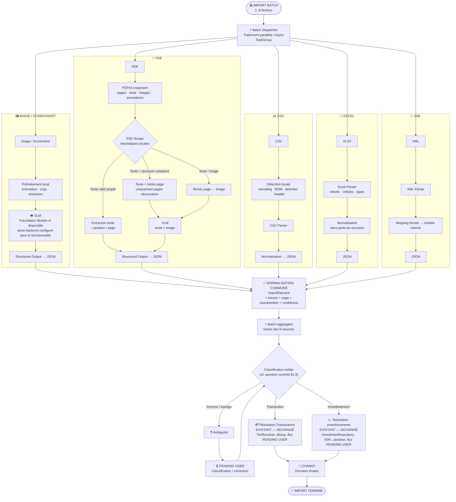

# SMART-IMPORT — Refonte import universel + IA multi-backend + métadonnées libres

> **Document de cadrage**, à donner tel quel à Claude Code pour prompter l'implémentation. Rien de cette spec n'est encore codé.
> Renommé depuis `SMORT-IMPORT.md` (typo) — contenu repris et complété.
> Présuppose la lecture de `CLAUDE.md`, en particulier **AXE U/V** (import actuel), **AXE T** (IA configurable actuelle), **AXE H** (décision "pas de modèle IA embarqué" — remise en question au §2).

---

## 1. Import universel — pipeline unifié multi-format

### 1.1 Objectif

Refondre le sous-système d'**ingestion** de l'import (transactions ET investissements, tous formats confondus) autour d'une architecture unique : chaque fichier traverse un sous-pipeline par type (image, PDF, CSV, XLSX, XML) qui produit un modèle d'échange commun (`ImportElement`), lequel alimente ensuite une résolution spécifique à chaque domaine (le besoin exact d'une étape de classification dédiée entre les deux est discuté au §1.3). Le tout en async/parallèle sur un batch de N fichiers.

### 1.2 Pourquoi une refonte plutôt qu'une évolution incrémentale

**Décision validée : remplacement complet**, pas de coexistence avec l'existant.

L'état actuel (AXE U/V) fonctionne mais est fragmenté : `BankStatementExtractor` (transactions) et `InvestmentStatementExtractor` (investissements) réimplémentent chacun leur détection de format, leur découpage OCR, leur réconciliation IA↔déterministe — avec des règles voisines mais dupliquées (ancrage par date vs ancrage par ISIN, mêmes pièges de normalisation de nombres, deux fenêtres de lecture différentes). `CSVParserV3` n'a aucun point de convergence avec les deux autres, et XLSX/XML n'existent pas encore. Résultat : chaque nouveau format ou bug (troncature de dates, décalage de fenêtre, OCR qui gèle sur macOS…) doit être corrigé plusieurs fois, dans plusieurs fichiers.

Le pipeline unifié devient le **seul** chemin d'import, pour les deux modules (transactions et investissements) et pour les trois entrées existantes (formulaire in-app, share sheet, App Intents).

⚠️ **Portée du remplacement, à ne pas élargir par erreur.** "Remplacement complet" vise uniquement le côté **ingestion** : détection de format → extraction → normalisation en `ImportElement`. Le côté **résolution** — tout ce qui se passe après (matching tiers/compte/catégorie, identification ISIN, rattachement de position, dédup, flux `PENDING USER`, commit) — **n'est pas réécrit**. Ce code fonctionne bien aujourd'hui et doit être réutilisé tel quel : `TierResolver`, l'orchestration de `ImportSessionViewModel`, la cascade de dédup (AXE B.1, `clusterKey`/`pendingSimilarIndices`), `InvestmentRepository` (résolution ISIN, `recomputePositionFromOrders`). Le pipeline unifié se branche à la place des extracteurs actuels (`BankStatementExtractor`, `InvestmentStatementExtractor`, `TransactionDocumentParser`, `InvestmentPDFParser`, `CSVParserV3`), sans toucher à ce qu'il y a après — voir le détail par composant au §1.6.

⚠️ **Ce que la refonte ne doit pas perdre.** Ce sont des bugs déjà trouvés et corrigés en production (device réel) — à réincarner dans les nouveaux modules plutôt qu'à redécouvrir :

- Décoder une image via **ImageIO** (`CGImageSourceCreateWithData`), jamais via `UIImage`/`NSImage.cgImage` — cette dernière est une API AppKit à affinité main-thread sur macOS et gèle l'app si appelée depuis une tâche détachée (AXE V).
- OCR et appel IA **systématiquement hors main actor** (`Task.detached`) — synchrones et coûteux (1-5 s sur une capture plein écran).
- Règle **"zéro push sur macOS"** pour tout écran de review empilé dans une `NavigationStack` déjà atteinte par push — sinon crash AutoLayout ou panneau masqué sous le contenu (AXE N.1, AXE V).
- **Sniffing par octets d'en-tête**, jamais par extension de fichier — une capture partagée arrive nommée `<uuid>.dat` (AXE U).
- Dates sans année : déduction par rapport à une date de référence, avec la règle "si la date déduite est dans le futur, c'est l'année précédente" (`BankStatementExtractor`).
- Validation **Luhn ISO 6166** pour ancrer sur un ISIN plutôt que sur une référence bancaire interne qui y ressemble.
- Motif numérique du séparateur de milliers décrit **explicitement** (`\d{1,3}(?:[ .,]\d{3})+`) — un `[\d ]*` permissif tronque silencieusement les montants.
- Réconciliation IA/déterministe par clé **(date, montant)**, **sans le signe** — le signe est justement ce que les deux sources lisent différemment (colonne DÉBIT sans signe explicite, par exemple).
- Plusieurs montants sur une même ligne (relevés tabulaires) = colonnes DÉBIT/CRÉDIT/SOLDE — prendre le premier, jamais le dernier (le solde).

### 1.3 Architecture cible



**Légende des étapes :**

- **Batch Dispatcher** : reçoit 1..N fichiers, les distribue par type (détecté par octets d'en-tête, jamais par extension) vers le sous-pipeline adapté, exécution parallèle via `TaskGroup` ; l'échec d'un fichier n'annule pas les autres.
- **Sous-pipelines par format** :
  - *Image* : prétraitement local (orientation/crop/résolution) → VLM (Foundation Models si la capacité "image" est disponible sur cet appareil, sinon le backend configuré pour cette fonctionnalité, cf. §2) → sortie structurée JSON.
  - *PDF* : inspection PDFKit → routeur heuristique local (texte natif simple / texte+structure complexe / scan-image) → extraction texte ou rendu page en image → VLM si nécessaire → JSON.
  - *CSV* : détection encodage/BOM/délimiteur/header (logique déjà éprouvée dans `CSVParserV3`, à porter telle quelle) → parse → JSON.
  - *XLSX* (nouveau format) : parse feuilles/cellules/types → normalisation sans perte de structure → JSON.
  - *XML* (nouveau format) : parse → mapping format bancaire connu → modèle interne → JSON.
- **Normalisation commune** : chaque JSON de sortie est ramené à un `ImportElement` unique (source, page/position, coordonnées si disponibles, confidence, payload brut) — c'est le seul point de passage obligé, quel que soit le format d'origine.
- **Batch Aggregator** : fusionne les `ImportElement` des N fichiers du batch en une seule liste.
- **Classification métier** : transaction / investissement / ambigu — dont l'utilité même est questionnée au §1.3, vu que la destination est déjà choisie dans le formulaire.
- **Résolution Transactions / Résolution Investissements** : mécanismes **existants, non modifiés** par cette refonte (`TierResolver`, `InvestmentRepository`, flux `PENDING USER` déjà en place aujourd'hui). Le pipeline unifié se contente de leur passer les candidats normalisés en entrée — le détail interne (matching tiers, dédup, identification ISIN, rattachement de position…) n'est pas repris ici : voir §1.2 (portée du remplacement) et §1.6 (correspondance) pour ce qui ne bouge pas.
- **Ambiguïté** : retour en classification après correction utilisateur.
- **Commit final** : écriture des données validées, fin d'import.

### Question ouverte pour Claude Code : le modèle `ImportElement` + l'étape `CLASSIFY` sont-ils encore nécessaires sous cette forme ?

Le diagramme (hérité du brouillon initial) classe chaque élément normalisé en Transaction / Investissement / Ambigu **après** extraction. Mais l'étape 1 du parcours (§1.4) fait déjà choisir la **destination** (module) à l'utilisateur **avant** le lancement de l'analyse, pour l'ensemble du batch — pas fichier par fichier.

Si la destination est connue dès le formulaire, la branche `CLASSIFY` top-level (Transaction vs Investissement vs Ambigu) devient potentiellement redondante : le batch pourrait être routé directement vers la résolution du module choisi, sans classification métier générique. Le modèle `ImportElement` garderait malgré tout un intérêt structurel indépendant de cette classification — format commun de sortie des 5 sous-pipelines, inspection JSON de debug (§1.4, étape 4), suivi de progression/confidence uniformisé. La vraie question est de savoir si ça vaut la peine de garder une couche de classification business par-dessus, ou si `ImportElement` doit directement porter un type déjà connu (`.transaction` / `.investment`, fixé par le formulaire), sans étape de décision.

**Ne pas trancher ici — évaluer à l'implémentation**, en tenant compte du fait qu'une sous-classification reste de toute façon nécessaire *à l'intérieur* du module Investissements (achat/vente/dividende/coupon/autre) : ce n'est pas résolu par le choix de destination en amont, il en faudra toujours une forme, quelle que soit l'option retenue ci-dessous.

1. **Garder `CLASSIFY` tel quel** — le batch reste réparti dans un des 3 chemins même si la destination est déjà connue ; sert alors de garde-fou (détecter qu'un utilisateur a importé le mauvais type de fichier dans le mauvais module) plutôt que d'aiguillage.
2. **Retirer `CLASSIFY` top-level** — `ImportElement` porte directement le module choisi en amont, la branche "Ambigu" disparaît au niveau batch (elle reste nécessaire *dans* la résolution Investissements, pour le type d'opération).
3. **`CLASSIFY` allégé** — pas de détection Transaction/Investissement (déjà connue), mais conservé comme détecteur d'anomalie ("ce fichier ne ressemble à rien de reconnu dans ce module" → `PENDING USER`) plutôt que comme aiguilleur.

### 1.4 UX / parcours utilisateur

#### Étape 1 — Formulaire d'import

- Choix du **module cible** (Transactions / Investissements), filtré par plan d'abonnement et modules activés. Le sélecteur doit re-vérifier le paywall à la sélection (pas seulement à l'affichage) — une destination pré-remplie par le point d'entrée peut devenir verrouillée entre-temps.
- Choix d'**un ou plusieurs fichiers** (PDF, XML, CSV, Excel, image) via le sélecteur système.
- Choix d'**une ou plusieurs images** depuis la photothèque (multi-sélection, iOS **et** macOS).
- Les deux sources (fichiers + photothèque) se cumulent dans une liste "en attente" affichée dans le formulaire — rien ne part avant validation explicite (modèle "accumuler puis importer" : lancer l'analyse dès la sélection empêcherait d'ajouter d'autres fichiers ensuite).
- Chaque entrée de la liste reste retirable individuellement avant lancement.
- Bouton "Lancer l'analyse" avec libellé dynamique (ex. "Importer 4 documents").

#### Étape 2 — Bandeau de session

- Dès le lancement, le formulaire se ferme et un **bandeau persistant** apparaît. L'analyse tourne en arrière-plan, portée par un coordinateur indépendant de toute vue affichée — fermer l'écran d'où l'import a été lancé ne doit jamais perdre le travail en cours.
- Le bandeau affiche :
  - le nombre total d'éléments en cours de traitement (N fichiers / pages / captures) ;
  - une barre de progression **déterminée** dès que le nombre d'unités à traiter est connu (comptage réel des pages/fichiers — jamais un `done/done` qui reste bloqué à 100 % en apparence) ;
  - une barre **indéterminée** tant que ce total n'est pas encore connu (ex. pendant l'ouverture d'un PDF dont le nombre de pages n'est découvert qu'à l'ouverture), ou quand il ne reste qu'une seule unité longue à traiter.
- Fermer le bandeau pendant l'analyse ⇒ confirmation ("interrompre l'analyse en cours ?" / "abandonner ce résultat ?" selon l'état), jamais un abandon silencieux.

#### Étape 3 — Traitement par format

- **CSV / XML** (formats tabulaires stricts) : ouverture d'une popup/inspecteur de **choix du séparateur et ajustement du format** (mapping des colonnes, aperçu, séparateur modifiable). Cette étape est interactive et bloque *ce fichier* en attendant l'utilisateur — elle ne bloque pas les autres fichiers du batch, qui continuent en parallèle.
- **Tous les autres formats** (PDF, XLSX, image) : traitement **entièrement en arrière-plan**, sans aucune interaction, jusqu'à la classification.

#### Étape 4 — Fin de traitement

- Le bandeau affiche le **résultat agrégé** : nombre total d'éléments trouvés, avec un détail dépliable **par source** (fichier/capture) — pour vérifier d'un coup d'œil qu'aucune source n'a été perdue en route sur un import multi-fichiers mêlant plusieurs formats.
- Pour chaque source, un petit bouton d'**inspection** ouvre le JSON brut de sortie du pipeline (debug) — sur la structure `ImportElement` normalisée, pas sur le texte OCR brut, pour couvrir aussi les formats sans OCR (CSV/XLSX/XML).
- Bouton "Continuer" → bascule vers l'étape d'**agrégation et vérification**, spécifique au module : session d'import avec revue ligne à ligne pour les transactions, ordres/positions rattachés à un compte pour les investissements. Les deux parcours de revue restent **distincts** — ils répondent à des questions différentes (résolution de tiers vs rattachement de positions).

### 1.5 Décisions retenues

| Sujet | Décision |
|---|---|
| Formats supportés | PDF, image (capture/photo), CSV, XLSX (nouveau), XML (nouveau) |
| Concurrence batch | `TaskGroup`, parallélisme par fichier, un échec n'annule pas les autres |
| Modèle d'échange | `ImportElement` unique (source, position, coordonnées, confidence, payload) pour tous les formats |
| Étape interactive obligatoire | uniquement CSV/XML (ambiguïté structurelle irréductible sans l'utilisateur) |
| PDF / image / XLSX | zéro interaction pendant le traitement |
| Debug | JSON `ImportElement` de sortie inspectable par source, depuis le bandeau de résultat |
| Persistance de l'analyse en cours | **Le système de cache de session existant est conservé** (`import_sessions`, autosave debounced 500ms, bandeau de reprise, rappel notification 12h) — et **étendu au module Investissements**, qui n'en bénéficiait pas jusqu'ici (asymétrie notée en AXE V, résorbée par cette refonte) |
| Résolution (matching, dédup, rattachement) | **réutilisée telle quelle, non réécrite** — cf. §1.6 |

### 1.6 Correspondance ancien → nouveau

⚠️ Cette table couvre le côté **extraction/ingestion**. Côté **résolution** (après classification), rien ne change — c'est le bloc du bas, à lire comme la limite de ce que cette refonte touche.

| Ancien | Devenir |
|---|---|
| `BankStatementExtractor` (ancrage date) | logique portée dans le sous-pipeline PDF/image, comme moteur déterministe de secours pour les transactions |
| `InvestmentStatementExtractor` (ancrage ISIN) | idem, moteur déterministe de secours pour les investissements |
| `TransactionDocumentParser` / `InvestmentPDFParser` | fusionnés dans le sous-pipeline PDF/image commun — la distinction transaction/investissement se fait à un moment à trancher (cf. encart §1.3), plus forcément par deux parseurs séparés en amont |
| `CSVParserV3` | devient le sous-pipeline CSV, logique de détection/parsing reprise telle quelle |
| `ColumnMappingView` | réutilisée comme popup d'ajustement CSV/XML de l'étape 3 |
| `DocumentImportCoordinator` | conservé comme le "Batch Dispatcher" côté app — orchestrateur hors-vue qui porte déjà le job en arrière-plan |
| `ImportDocumentReader` | devient le point d'entrée des sous-pipelines PDF/image (découpage en unités) |
| `ImportSessionRepository` / `import_sessions` (cache de session) | **conservé et étendu** aux investissements — cf. §1.5 |
| *nouveau* sous-pipeline XLSX | à créer (parser feuilles/cellules) |
| *nouveau* sous-pipeline XML | à créer (parser + mapping par format bancaire connu, extensible) |
| **— résolution, non touchée par cette refonte —** | |
| `TierResolver`, matching tiers/compte/catégorie | **conservé tel quel** — fonctionne bien, hors périmètre |
| Cascade de dédup à la résolution (AXE B.1, `clusterKey`/`pendingSimilarIndices`) | **conservé tel quel** — hors périmètre |
| `InvestmentRepository` (ISIN → ticker, rattachement position, `recomputePositionFromOrders`) | **conservé tel quel** — fonctionne bien, hors périmètre |
| Flux `PENDING USER` (choix tiers/compte/catégorie, sélection instrument/dividende/coupon) | **conservé tel quel** — hors périmètre |

### 1.7 Hors scope (pour cette itération)

- Dédoublonnage des transactions au commit (reste un simple `INSERT`, comportement préexistant) — non traité par cette refonte.
- Formats de relevés étrangers non-FR pour XML — à traiter au cas par cas quand un format réel remonte.

---

## 2. IA multi-backend par fonctionnalité + marketplace de modèles

### 2.1 Contexte

AXE T a livré un réglage **global par appareil** (`AIBackendPreference` : Automatique / Serveur local / Désactivé), consommé par un point de dispatch unique `AIEnrichmentBackend`. Suffisant tant qu'une seule capacité était en jeu (texte). Ça ne l'est plus : Foundation Models sait faire du texte depuis iOS 26, mais l'**image** seulement depuis iOS 27. Un réglage global ne peut pas représenter "sur cet iPhone en iOS 26, je veux Foundation Models pour l'enrichissement marchand (texte), mais un serveur local pour l'import de captures d'écran (image, non supportée par FM sur cet OS)".

**Décision validée : le réglage devient par fonctionnalité**, pas global.

⚠️ **Tension avec une décision existante, à assumer explicitement.** AXE H a retiré tout modèle IA embarqué ("Pas de modèle IA embarqué. Trop coûteux (~350MB-1GB) pour une feature optionnelle") et supprimé les dépendances MLX du projet. Le §2.5 ci-dessous (télécharger des modèles locaux depuis une marketplace) **rouvre ce choix**. À l'implémentation : mettre à jour AXE H dans `CLAUDE.md` pour documenter le changement de cap, plutôt que de laisser les deux décisions se contredire silencieusement dans le même fichier.

### 2.2 Fonctionnalités IA à câbler individuellement

| Fonctionnalité | Capacité requise | Fichier(s) actuels |
|---|---|---|
| Enrichissement marchand (identification tiers) | texte (+ image en option, futur) | `EnrichmentOrchestrator`, `EnrichmentLLMService` |
| Recherche avancée — raffinement de requête | texte, sortie structurée | `LLMQueryRefinement` (AXE S) |
| Import de relevés — transactions | texte + **image** | `TransactionDocumentParser` (AXE V) |
| Import de relevés — investissements | texte + **image** | `InvestmentPDFParser` (AXE U/V) |
| *(futur)* Coach financier / insights dashboard | texte | pas encore IA-assisté (AXE Q) |

Chaque fonctionnalité déclare ses **capacités requises** (texte seul / texte+image / sortie structurée `@Generable`). C'est ce qui permet au mode "Automatique" de sauter Foundation Models pour une fonctionnalité qui a besoin d'image sur un appareil en iOS 26, tout en le gardant pour une fonctionnalité texte-only sur ce même appareil.

### 2.3 Backends disponibles (par fonctionnalité)

- **Automatique** (défaut) : Foundation Models si la capacité requise est disponible sur cet appareil/OS, sinon repli sur le meilleur backend configuré pour cette fonctionnalité, sinon désactivé silencieusement.
- **Foundation Models forcé** : erreur explicite si la capacité demandée n'est pas disponible (pas de repli silencieux) — utile pour diagnostiquer.
- **Serveur distant compatible OpenAI** (existant, AXE T : LM Studio, Ollama… — URL + modèle + clé optionnelle).
- **Fournisseur cloud** *(nouveau)* : GPT / Claude / Gemini — clé API utilisateur en Keychain. Avertissement explicite dans l'UI : **non recommandé pour la confidentialité 100% locale**, les données de cette fonctionnalité quittent l'appareil.
- **Modèle local téléchargé** *(nouveau, cf. §2.5)* : modèle open-weight tournant on-device (Llama, Qwen…), aucun réseau après téléchargement.
- **Désactivé** : jamais d'appel IA pour cette fonctionnalité.

### 2.4 UI Réglages

- `AISettingsView` devient une **liste de fonctionnalités**, chacune avec son propre picker de backend (au lieu du picker unique actuel).
- Un backend configuré une fois (serveur local, clé cloud) est **réutilisable** par plusieurs fonctionnalités — pas de reconfiguration à chaque fois.
- Sous-écran "Modèles locaux" : modèles déjà téléchargés (taille disque, bouton supprimer) + marketplace de modèles recommandés (nom, taille, capacité texte/image, licence, bouton télécharger avec progression).
- Indicateur par fonctionnalité de la capacité effective sur cet appareil (ex. badge "Image non supportée par Foundation Models ici — bascule serveur, cloud ou modèle local nécessaire").

### 2.5 Téléchargement de modèles locaux

🔴 Points à trancher avec Edwin avant toute implémentation :

- Runtime d'inférence on-device : MLX (retiré en AXE H, à réintégrer) vs llama.cpp/GGUF vs autre.
- Source de la marketplace : catalogue Hugging Face directement, ou liste curatée maintenue par Nemoris.
- Poids attendu par modèle recommandé (1-4 Go probable) → gestion d'espace disque, avertissement avant téléchargement en cellulaire.
- Isolation par appareil : comme le reste d'AXE T, un modèle téléchargé sur le Mac n'implique pas qu'il existe sur l'iPhone.

### 2.6 Hors scope

- Fine-tuning ou personnalisation des modèles.
- Auto-sélection du "meilleur" backend par mesure de qualité — le choix reste manuel/déclaratif par fonctionnalité.

---

## 3. Métadonnées de transaction libres (remplacement du mode de paiement)

### 3.1 Contexte

Aujourd'hui, `transactions.payment_type_id` référence une table fermée `payment_types` (CB, virement, espèces…). C'est le seul attribut "libre" qu'un utilisateur peut poser sur une transaction en dehors de tiers/catégorie/tags. Limitant : un utilisateur peut vouloir tracker autre chose (compte joint vs perso, professionnel/perso, projet…) sans que ce soit un "mode de paiement".

### 3.2 Décision

Remplacer le champ fixe "mode de paiement" par un système de **métadonnées clé-valeur libres**, définies par l'utilisateur. Par défaut, **aucune métadonnée n'est pré-remplie** : pas de "mode de paiement" de base dans le schéma — l'utilisateur crée ses propres clés de métadonnées s'il en a l'usage (il peut recréer lui-même une clé "Mode de paiement" s'il le souhaite, mais ce n'est plus un concept de premier ordre imposé par l'app).

### 3.3 Schéma proposé (à valider)

```sql
CREATE TABLE transaction_metadata_keys (
  id INTEGER PRIMARY KEY AUTOINCREMENT,
  name TEXT NOT NULL UNIQUE,       -- ex. "Mode de paiement", "Projet"
  icon TEXT,                       -- SF Symbol optionnel
  created_at TEXT NOT NULL
);

CREATE TABLE transaction_metadata_values (
  transaction_id INTEGER NOT NULL REFERENCES transactions(id) ON DELETE CASCADE,
  key_id INTEGER NOT NULL REFERENCES transaction_metadata_keys(id) ON DELETE CASCADE,
  value TEXT NOT NULL,
  PRIMARY KEY (transaction_id, key_id)
);
```

- Une transaction peut porter **plusieurs** métadonnées (contrairement à `payment_type_id`, qui était 0..1).
- Valeur en texte libre au départ (pas de validation de type) ; les "valeurs déjà utilisées pour cette clé" peuvent être proposées en suggestion côté UI, sans contrainte en base.

### 3.4 Migration des données existantes

- Migration SQLite : créer une clé `transaction_metadata_keys` nommée "Mode de paiement" (pour ne rien perdre), et convertir chaque `transactions.payment_type_id` non-NULL en une ligne `transaction_metadata_values`.
- `payment_types` et `transactions.payment_type_id` : **dépréciés, pas supprimés immédiatement** — cohérent avec la doctrine du repo (colonnes/tables legacy retirées seulement une fois confirmé qu'elles ne sont plus référencées nulle part, cf. AXE H).
- Sync (AXE L) : les deux nouvelles tables doivent être ajoutées à `SyncSchema.syncedTables` et suivre la checklist de déploiement du schéma CloudKit Production (AXE L.8) avant tout ship.

### 3.5 UI

- Sur la fiche transaction : section "Métadonnées" — clés existantes affichées + bouton "Ajouter une métadonnée" (choisir une clé existante ou en créer une nouvelle) + valeur en texte libre avec suggestions.
- Écran de gestion des clés de métadonnées (créer/renommer/supprimer/réordonner), sur le modèle de la gestion des catégories/groupes de tiers déjà existante.
- Filtre par métadonnée dans les listes de transactions, comme le filtre par tag aujourd'hui.

### 3.6 Hors scope

- Métadonnées typées (nombre, date, choix fermé) — texte libre uniquement pour cette itération.
- Métadonnées sur d'autres entités que les transactions (positions, remboursements…).

---

## Points ouverts avant de lancer l'implémentation

1. Ordre de priorité entre les 3 chantiers — le multi-backend IA (§2) est un prérequis technique pour que l'import (§1) fonctionne pleinement en mode image sur tous les OS.
2. §2.5 : choix du runtime d'inférence local et de la source de la marketplace — bloquant avant tout code sur ce point précis.
3. §1.3 : nécessité (ou non) de la classification métier top-level (`CLASSIFY`) une fois la destination déjà choisie dans le formulaire — cf. encart dédié, à trancher à l'implémentation, pas dans ce cadrage.
